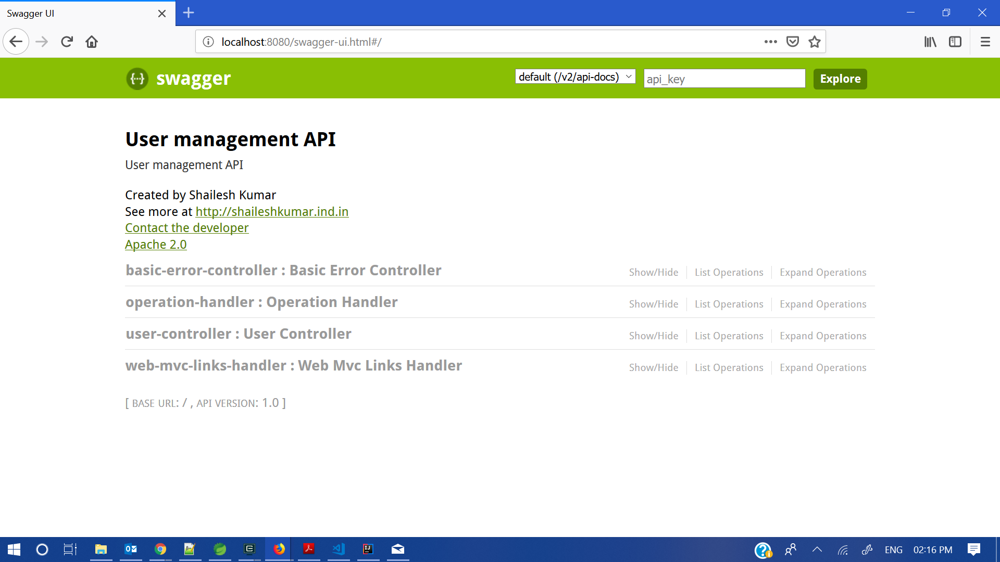
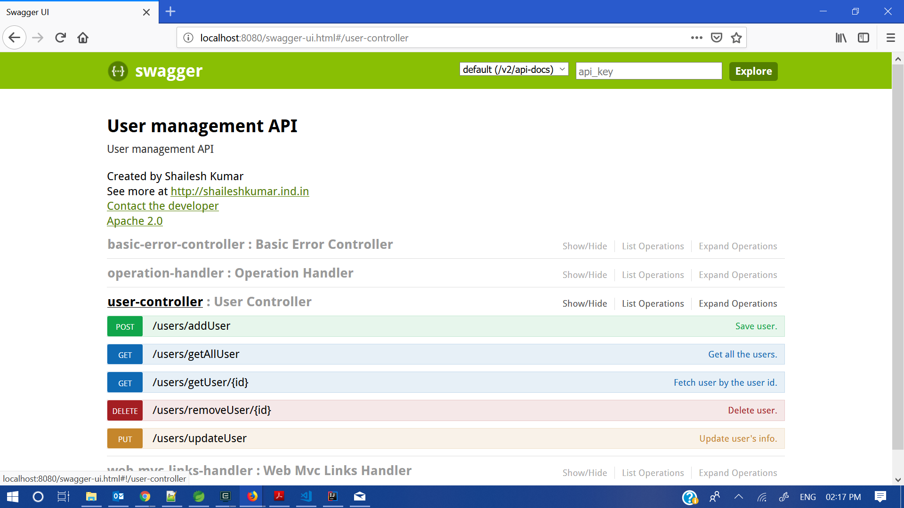
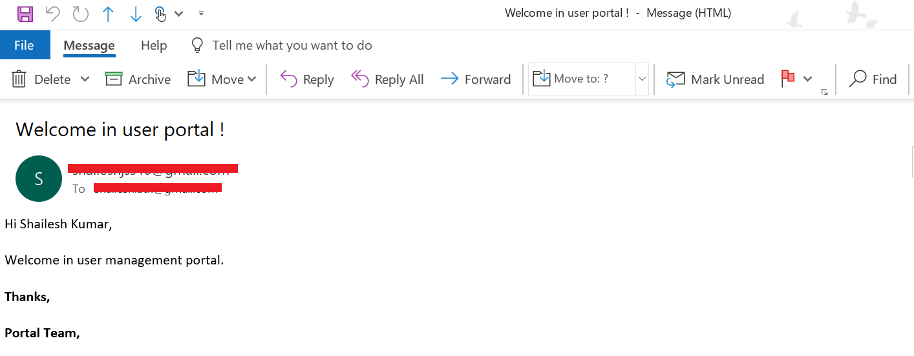

# Getting Started With User's APIs

## Guides to clean build and deploy

Here we'll see different ways to deploy and run this application.

### Clean and Build Maven application

1. Clean and Build application

    mvn clean install
    
2. Run application using commandline

    mvn spring-boot:run
    
    
### Deploy application using docker command

1. Goto the project root directory via commandline.

2. Run below command to create docker image;

    docker build -f DockerFile -t usermanagementapi . 
    
3. Verify the docker image of project using,

    docker images ls
    
4. Run docker image using below command,

    docker run -p 8080:8080 usermanagementapi
    
5. Check docker container, verify using,

    docker container ls

### Check application UI and document using Swagger tool

Start the application with any of the 2 options mentioned above and hit URL http://localhost:8080/swagger-ui.html

We can see a UI with some basic information about APIs and available APIs here;

and under userController api tab, we can get multiple apis available for users management.

There are CRUD operation (Add users, Get all users details, Get individual user detail, update user and delete user) for users.

### Enable email utility

1. Goto application.properties file and enter your gmail id and password in spring.mail.username, spring.mail.password properties respectivily.

2. Then you need to provide access through your gmail account setting. For this you can access https://myaccount.google.com/security and goto "Less secure app access" card and enable less security to use your account by third party apps.

3. You will get email while register any new users,

